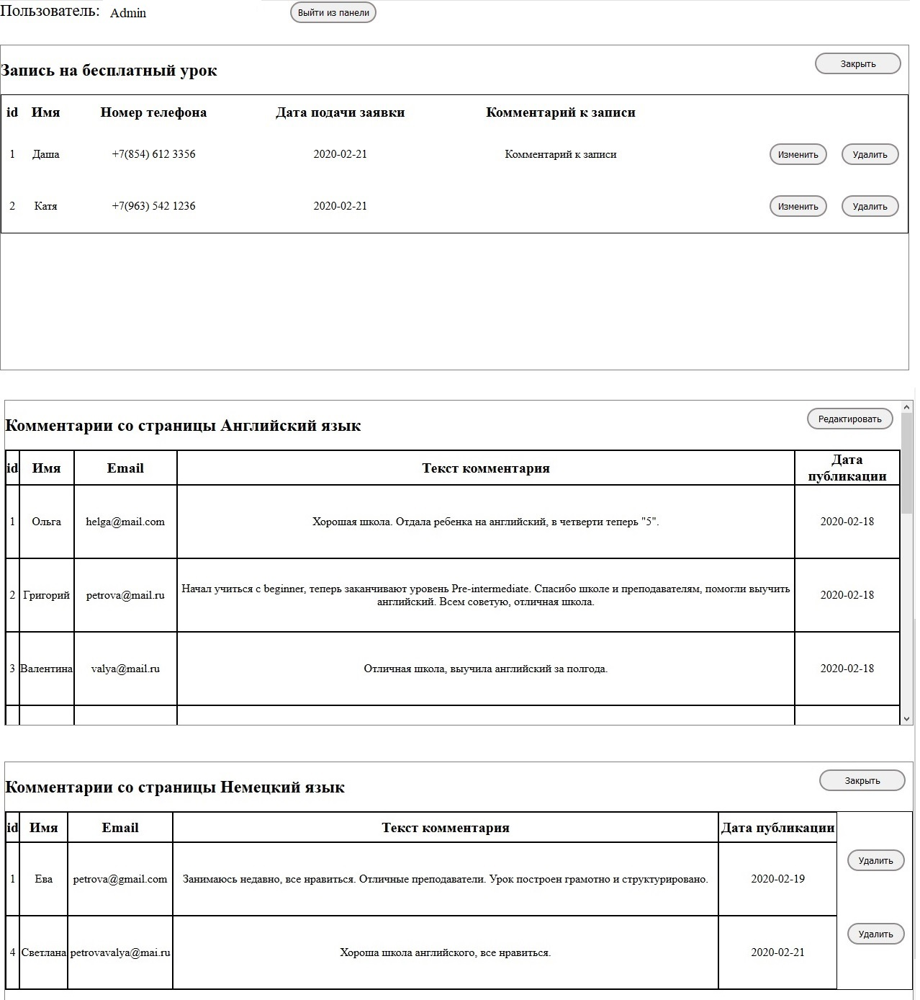

# Website Language School
[View website](http://lang-school.epizy.com/)

The site is a practical work and was written with the aim of learning: the basics of layout,  JQuery library and PHP.
The data from the registration form for the Free lesson is recorded in a table and can be edited and deleted from the admin panel.
Comments are uploaded to the page from the database. All new comments are added to the database via the "Leave a comment" form. In the admin panel, you can delete comments uploaded to the page.

## Features
- PHP
- CSS
- JQuery
- MySQL DB
- Browsers Google Chrome, FireFox, Opera, Edge
- Do not support IE

## Admin Panel Description
Admin panel with tables for editing. Data in tables is loaded from the database.
In the table "Registration for a free lesson," the administrator can make comments on the recording. Edit cells "Name" and "Phone number"

